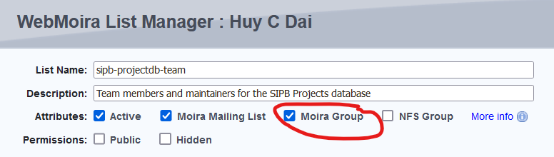

# Checking Mailing List Membership

Date: December 14th, 2022

Due to limitations with Scripts not being able to directly access Moira mailing lists, we needed an alternative method to check the membership of groups so we can give the right people edit permissions for projects without having to explicitly define them as a project contact on the website. One way we found that works is to i) Convert the Moira mailing list to be an AFS group and ii) check membership using `pts` command

1. Convert Moira mailing list into an AFS group

This is done by going to WebMoira and checking the "Moira group" checkbox, which makes the mailing list into an AFS group.



Alternatively, you can also run the command `blanche -G <listname>`

2. Once you having a working AFS group, you can check its membership with `pts membership system:<listname>`. The "system" refers to the athena.mit.edu locker, which is normally the case for Moira mailing lists that are turned into an AFS group (see: <https://sipb.mit.edu/doc/afs-and-you/#CreatinganAFSGroup>)

Example of the output is: 
```sh
[sipb-projectdb@cats-whiskers]:~/web_scripts$ pts membership system:sipb-projectdb-team
libprot: unable to build security class (getting token)
libprot: Could not get afs tokens, running unauthenticated
Members of system:sipb-projectdb-team (id: -116455) are:
  markchil
  huydai
```
**Note:** This command is being run from the Scripts locker 

If the mailing list is empty, then it returns:
```sh
[sipb-projectdb@cats-whiskers]:~/web_scripts$ pts membership system:sipb-projectdb-team
libprot: unable to build security class (getting token)
libprot: Could not get afs tokens, running unauthenticated
Members of system:sipb-projectdb-team (id: -116455) are:
```

Alternatively, if the list in question is not an AFS group, then:
```sh
[sipb-projectdb@cats-whiskers]:~/web_scripts$ pts membership system:some-garbage
libprot: unable to build security class (getting token)
libprot: Could not get afs tokens, running unauthenticated
pts: User or group doesn't exist so couldn't look up id for system:some-garbage
```

Parser code (ongoing):
```
#!/usr/bin/python3
import subprocess

res = subprocess.check_output(['pts', 'membership','system:sipb-projectdb-team'])
res = res.decode('utf-8')

if "User or group doesn't exist" in res:
        print(False)
res = res.split("\n")

try:
        delimiter = "Members of "
        delimiter_index = [i for i in range(len(res)) if res[i].startswith(delimiter)][0]
except ValueError:
        print(False)

res = res[delimiter_index+1:]
print(res)
```